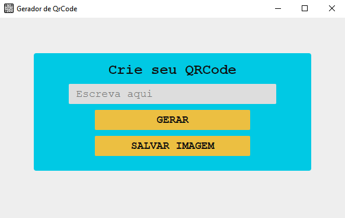

<h1 align='center'>Gerenciador de gastos </h1>
<h3 align='center'>
  <a href="#tecnologias">Tecnologias</a> |
  <a href="#sobre">Sobre</a> |
  <a href="#pre-requisitos">Pré-requisitos</a> 
</h3>

# Tecnologias
Para a construção do projeto utilizei as seguintes tecnologias:
  <ul> 
    <li>HTML</li>
    <li>CSS</li>
    <li>JavaScript</li>
    <li>NodeJS</li>
    <li><a href='https://www.electronjs.org/' target='_blank'>ElectronJS</a></li>
    <li><a href='https://www.npmjs.com/package/qrcode' target='_blank'>qrcode</a></li>
  </ul>


<hr/>

# Sobre
<p>  
  Projeto bem simples, com ele consegui ter uma noção básica de como funciona o Framework Electron e como utilizar uma biblioteca externa. Essa versão do projeto é de desenvolvimento apenas.
</p>

  
## Funcionalidades

  - [X]Gerar QRcode apartir de qualquer texto/link
  - [X]Salvar a imagem em qualquer pasta

## 

# Pre-requisitos

Para testar o projeto na sua maquina você irá precisar das seguintes ferramentas:
[Git](https://git-scm.com/), [Node](https://nodejs.org/en/). Além disso é ideal usar um bom editor para trabalhar com código como o [VSCode](https://code.visualstudio.com/)

```bash
#Clone este repositorio

$ git clone <https://github.com/viteydev/gerador-de-qrcode>

#Lembre-se de acessar a pasta do projeto

$ cd gerador-de-qrcode

#Assim que estiver na pasta, adicione o seguinte comando
#Dessa forma as dependencias da aplicação serão baixadas e o projeto podera funcionar corretamente.

$ npm install

#Agora basta iniciar o projeto

$ npm start

```

#### Feito por Vitor 👍 | Veja meu [Linkedin](https://www.linkedin.com/in/vitor-lemos-1a61b3238/)
